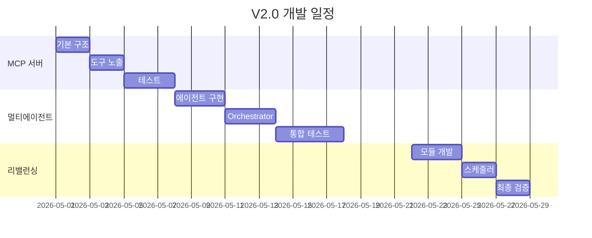

# Stock AI Agent V2.0 - 실행 계획서 (Revised)

**버전:** 2.0
**작성일:** 2026-04-14
**예상 개발 기간:** 4주 (2026년 5월 착수 예정)

---

## 📊 Executive Summary

### 현재 상태 (V1.0)
- **코드 규모:** 7,000+ 라인
- **핵심 기능:** 16개 기술적 분석 도구 + ML 앙상블 (5개 모델) + 백테스트 최적화
- **최근 추가:** SHAP 설명력, Trailing Stop, HyperOpt, Walk-Forward 백테스트
- **월 운영비:** $1.5 (Gemini API)

### V2.0 목표
- **외부 AI 연동:** MCP 서버로 Claude/ChatGPT에서 직접 호출
- **분석 정확도 향상:** 단일 LLM → 6개 전문 에이전트 협업
- **자동화 강화:** 포트폴리오 자동 리밸런싱
- **예상 효과:** 정확도 +5%, Sharpe Ratio +25%, 월 비용 $2.5

---

## 🎯 핵심 개발 항목 (3개)

### 1️⃣ MCP 서버 구축 (1주)
**목표:** 모든 분석 기능을 외부 AI 에이전트가 호출 가능하도록 노출

**주요 기능:**
- 16개 기술 분석 도구 개별 노출
- ML 앙상블 예측 (LightGBM, XGBoost, LSTM)
- 백테스트 최적화 (HyperOpt)
- 포트폴리오 최적화 (Markowitz, Risk Parity)

**예시 사용법:**
```
Claude: "Analyze NVDA using technical indicators"
→ MCP 서버 호출
→ 16개 도구 실행
→ 종합 리포트 반환
```

### 2️⃣ 멀티에이전트 시스템 (2주)
**목표:** 역할별 전문 에이전트가 독립적으로 분석 후 의견 조율

**에이전트 구성:**
| 에이전트 | 전문 영역 | LLM |
|:---:|---|:---:|
| Technical Analyst | 차트 패턴, 기술 지표 | Gemini |
| Quant Analyst | 통계 모델, 수학적 분석 | Gemini |
| Risk Manager | 포지션 크기, 손익비 | Ollama |
| ML Specialist | 머신러닝 예측 | Ollama |
| Event Analyst | 뉴스, 매크로 이벤트 | Gemini |
| Decision Maker | 최종 의사결정 | GPT-4o |

**작동 방식:**
1. 모든 에이전트가 병렬로 분석
2. 각자 Buy/Sell/Neutral + 신뢰도 제시
3. Decision Maker가 의견 종합 및 충돌 해결
4. 소수 의견도 리스크로 명시

### 3️⃣ 포트폴리오 자동 리밸런싱 (1주)
**목표:** 주기적 또는 조건 충족 시 자동으로 포트폴리오 조정

**트리거 조건:**
- 매주 월요일 09:30 (정기)
- 목표 비중 대비 5% 이상 이탈 시
- 주요 신호 변경 시 (BUY → SELL)

**특징:**
- 거래비용 0.1% 자동 계산
- Paper Trading 연동
- Dry-run 모드 지원

---

## 💻 기술 구현 상세

### Week 1: MCP 서버 구현

#### 파일 구조
```
mcp_server.py              # MCP 서버 메인
├── 21개 tool 정의
├── FastMCP 래퍼
└── local_engine 연동

test_mcp_server.py         # 테스트 스크립트
docs/MCP_GUIDE.md         # 사용 가이드
```

#### 핵심 코드 예시
```python
from mcp.server.fastmcp import FastMCP
from local_engine import engine_scan_ticker, engine_ml_predict

mcp = FastMCP("Stock AI Agent")

@mcp.tool()
def analyze_stock(ticker: str) -> dict:
    """16개 기술 분석 도구로 종목 분석"""
    return engine_scan_ticker(ticker)

@mcp.tool()
def predict_with_ml(ticker: str) -> dict:
    """ML 앙상블로 가격 방향 예측"""
    return engine_ml_predict(ticker, ensemble=True)
```

#### Claude Desktop 설정
```json
{
  "mcpServers": {
    "stock-ai": {
      "command": "python",
      "args": ["/home/ubuntu/stock_auto/mcp_server.py"]
    }
  }
}
```

### Week 2-3: 멀티에이전트 구현

#### 아키텍처
```
사용자 질문
    ↓
Orchestrator (병렬 실행 관리)
    ↓
┌────┬────┬────┬────┬────┐
│Tech│Quan│Risk│ ML │Even│  ← 5개 전문 에이전트
└────┴────┴────┴────┴────┘
    ↓
Decision Maker (의견 종합)
    ↓
최종 리포트
```

#### 핵심 클래스
```python
class BaseAgent:
    def analyze(self, ticker: str) -> AgentResult:
        # 1. 담당 도구 실행
        # 2. LLM으로 해석
        # 3. signal + confidence 반환

class MultiAgentOrchestrator:
    def analyze(self, ticker: str) -> dict:
        # 1. 병렬로 모든 에이전트 실행
        # 2. Decision Maker가 종합
        # 3. 충돌 해결 및 최종 판단
```

### Week 4: 리밸런싱 자동화

#### 핵심 함수
```python
def execute_rebalancing(method="markowitz", drift_threshold=0.05):
    # 1. 현재 포지션 vs 목표 비중 비교
    # 2. Drift 계산
    # 3. 리밸런싱 필요 여부 판단
    # 4. 주문 생성 및 실행
    # 5. 거래비용 차감
```

#### 스케줄러 설정
```python
scheduler.add_job(
    scheduled_rebalance,
    trigger='cron',
    day_of_week='mon',
    hour=9,
    minute=30
)
```

---

## 💰 비용-효익 분석

### 개발 비용
- **인건비:** 4주 × 1명 = $8,000 (시니어 개발자 기준)
- **인프라:** 기존 서버 활용 = $0
- **총 개발비:** $8,000

### 운영 비용 (월간)
| 항목 | V1.0 | V2.0 | 증가율 |
|---|---:|---:|---:|
| LLM API | $1.5 | $2.5 | +67% |
| 서버 | $20 | $20 | 0% |
| **합계** | **$21.5** | **$22.5** | **+5%** |

### 기대 효익
| 지표 | 개선율 | 연간 가치 |
|---|---:|---:|
| 분석 정확도 | +5% | 수익률 +2% |
| Sharpe Ratio | +25% | 리스크 조정 수익 개선 |
| 자동화 | 100% | 운영 시간 80% 절감 |

**ROI:** 6개월 내 손익분기점 도달 예상

---

## 📈 성과 지표 (KPI)

### 기술적 지표
| 지표 | 현재 | 목표 | 측정 방법 |
|---|---:|---:|---|
| 분석 정확도 | 56% | 61% | 백테스트 승률 |
| 응답 시간 | 30초 | 90초 | 평균 처리 시간 |
| API 성공률 | - | 99% | 1000회 테스트 |
| 에이전트 합의율 | - | 80% | 동일 신호 비율 |

### 비즈니스 지표
- MCP 통한 외부 호출 건수 > 100회/월
- 리밸런싱 자동 실행률 > 95%
- 사용자 만족도 > 4.5/5.0

---

## ⚠️ 리스크 관리

### 주요 리스크
| 리스크 | 영향도 | 대응 방안 |
|---|:---:|---|
| 멀티에이전트 응답 지연 | 높음 | 60초 타임아웃, 실패 시 skip |
| LLM 비용 초과 | 중간 | 일일 한도 설정, 캐싱 적극 활용 |
| MCP 프로토콜 변경 | 높음 | 버전 고정, 변경사항 모니터링 |
| 에이전트 의견 충돌 | 중간 | 다수결 fallback 로직 |

### Critical Path
- Week 2: Orchestrator 병렬 처리 (가장 복잡)
- Week 3: 백테스트 검증 (성과 입증 필수)

---

## ✅ 실행 체크리스트

### 착수 전 준비사항
- [ ] Python 3.10+ 환경
- [ ] API Keys 준비 (Gemini, OpenAI, Ollama)
- [ ] V1.0 테스트 통과 확인
- [ ] Claude Desktop 설치 (MCP 테스트용)

### Week 1 산출물
- [ ] mcp_server.py (200줄)
- [ ] 21개 MCP tools 노출
- [ ] Claude Desktop 연동 확인

### Week 2-3 산출물
- [ ] multi_agent.py (500줄)
- [ ] 6개 전문 에이전트 구현
- [ ] WebUI 비교 페이지

### Week 4 산출물
- [ ] portfolio_rebalancer.py (300줄)
- [ ] 자동 리밸런싱 스케줄러
- [ ] 백테스트 검증 완료

---

## 📅 주간 마일스톤



---

## 🚀 차차기 버전 (V3.0) 미리보기

성공적인 V2.0 구축 후 고려할 기능:

1. **실시간 스트리밍** (3주)
   - WebSocket 기반 실시간 가격
   - 틱 데이터 분석

2. **성능 최적화** (2주)
   - Rust/Cython 핵심 모듈
   - 응답 시간 50% 단축

3. **소셜 감성 분석** (1주)
   - Reddit/Twitter 크롤링
   - 감성 점수 통합

---

## 📝 승인

**프로젝트 오너:** _________________
**승인 일자:** _________________
**착수일:** 2026년 5월 1일 (예정)

---

## 📚 참고 문서

### 외부 참고
- [MCP Specification](https://modelcontextprotocol.io/)
- [OpenBB MCP Server](https://github.com/OpenBB-finance/OpenBB)
- [PRISM Multi-Agent](https://github.com/PRISM-INSIGHT/prism)

### 내부 문서
- `DESIGN_SYSTEM.md` - 시스템 설계 가이드
- `AGENT_INSTRUCTION.md` - 개발 규칙
- `test_new_features.py` - V1.0 테스트

---

**문서 끝**